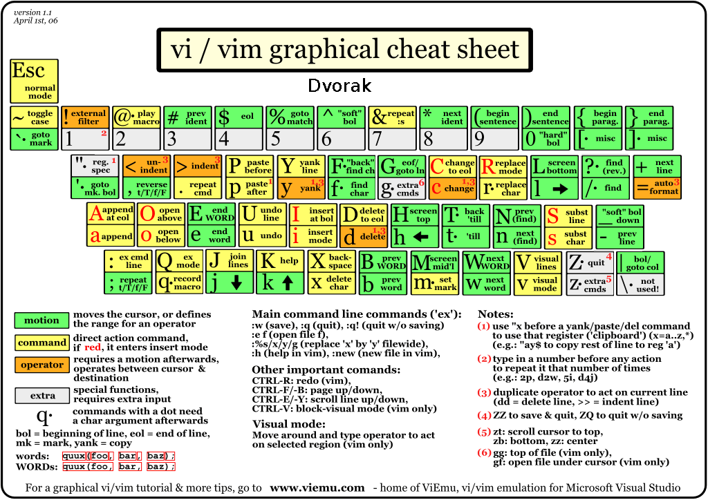

> [!Notes:]  
> Quick Vim reference for common commands and navigation.

---

## Basic Commands

| Command         | Description                    |
| --------------- | ----------------------------- |
| `i`             | Insert mode                    |
| `esc`           | Escape insert mode             |
| `:q`            | Quit                           |
| `:w`            | Write (save)                   |
| `:e`            | Edit/open file                 |
| `v`             | Visual mode                    |
| `:set number`   | Show line numbers              |
| `:wq`           | Write and quit                 |
| `/search-query` | Search in Vim                  |
| `:vsplit`       | Vertical split                 |
| `:e filename.c` | Open new file                  |
| `:h [command]`  | Help for command               |

---

## Running a C Program

```sh
$ gcc file.c -o prog
$ ./prog
```

---

## Navigation

```
   K
 H   L
   J
```

| Command           | Description                                 |
| ----------------- | ------------------------------------------- |
| `gg`              | Go to top of file (line 1)                  |
| `G`               | Go to bottom of file                        |
| `:line_no`        | Jump to specific line                       |
| `Shift+H`         | Top of the screen                           |
| `Shift+M`         | Middle of the screen                        |
| `zz`              | Center screen on cursor                     |
| `ctrl+w` + `→`    | Move between splits/tabs                    |

#### Find and Move

- `/main` — search for "main"
- `zz` — center the screen on cursor

#### Navigation in Current Line

| Command | Description                      |
| ------- | -------------------------------- |
| `e`     | End of current word              |
| `b`     | Back to start of previous word   |
| `w`     | Start of next word               |
| `0`     | Start of line                    |
| `$`     | End of line                      |

---

## Select, Copy, Paste

- Enter visual mode: `v`
- Select entire row: `Shift+V`
- Copy (yank): `y`
- Copy (yank) to system clipboard: `"+y`
- Paste: `p`
- Delete active line: `dd`
- Delete word: `de`
- Delete lines: `:[start],[end]d`
- Quit without saving: `:q!`

> When `%` is pressed in visual mode, it selects text between matching brackets (useful for functions).

---

## Undo and Redo

| Command         | Description |
| --------------- | ----------- |
| `u`             | Undo        |
| `ctrl+r`        | Redo        |

---

## Search and Replace

```vim
:s/searching-text/replacing-text/g
```
`g` is for global (all matches in selection or file).

---

## Typing & Editing

| Command | Description                                         |
| ------- | --------------------------------------------------- |
| `yy`    | Copy (yank) entire line                             |
| `p`     | Paste                                               |
| `A`     | Insert mode at end of line                          |
| `v$`    | Select from cursor to end of line                   |
| `v0`    | Select from cursor to start of line                 |

---

[Read More](https://www.vim.org/docs.php)
